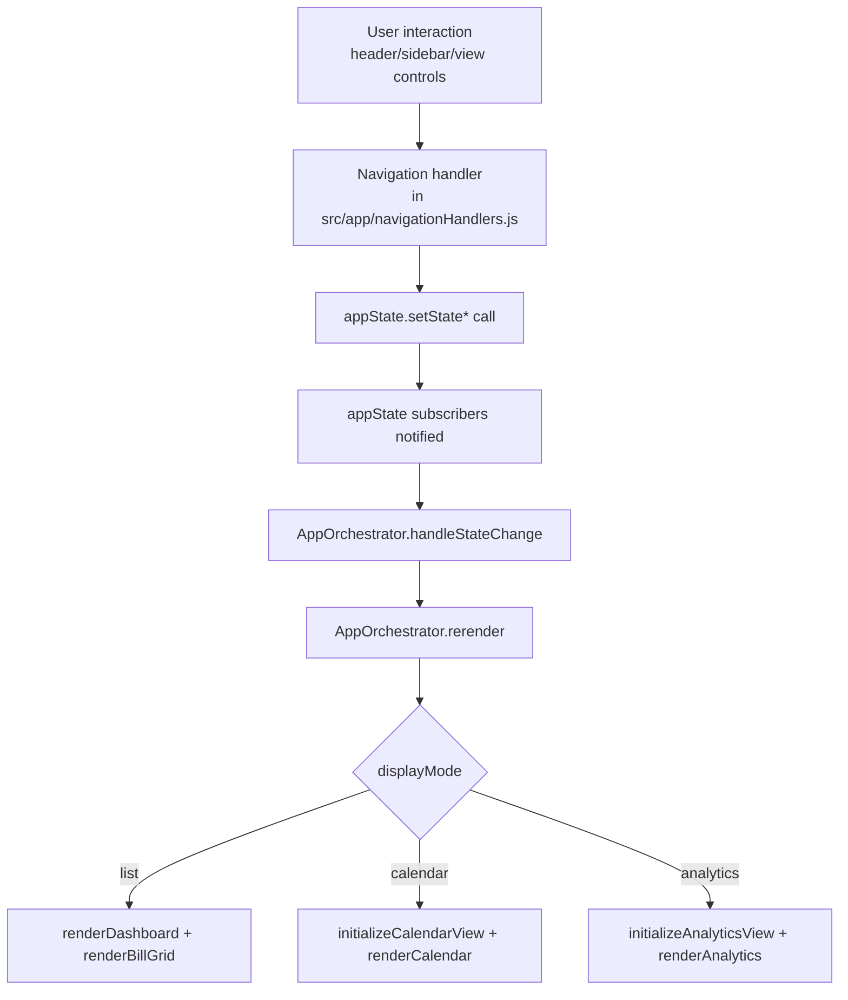
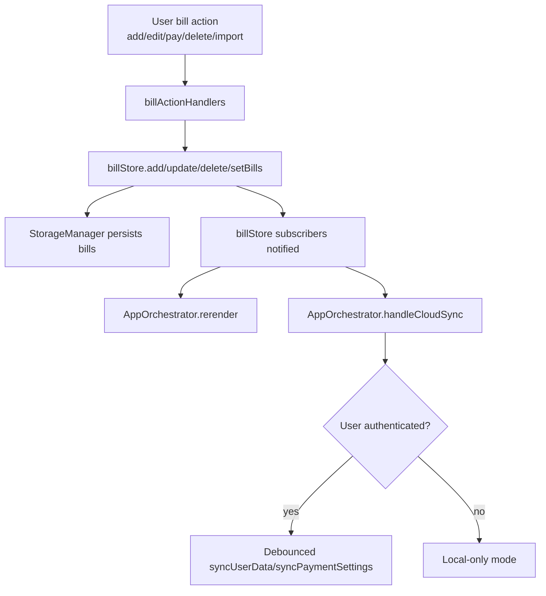
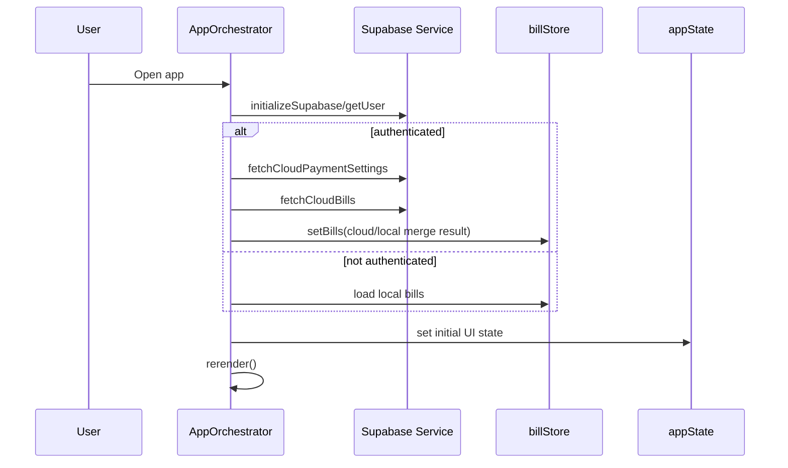

# State Management Guide

This guide explains how state is managed across UI state, bill data, persistence, and re-rendering.

## Core Principle

The app separates state into two stores:

- `appState` (`src/store/appState.js`) for UI/view state.
- `billStore` (`src/store/BillStore.js`) for bill data and persistence.

`src/app.js` (AppOrchestrator) coordinates both and owns rendering decisions.

---

## Store Responsibilities

## `appState` (UI state)

`appState` tracks transient and UI-level concerns:

- `selectedPaycheck: number | null`
- `selectedCategory: string | null`
- `viewMode: 'filtered' | 'all'`
- `displayMode: 'list' | 'calendar' | 'analytics'`
- `paymentFilter: 'all' | 'paid' | 'unpaid'`
- `showCarriedForward: boolean`
- `currentCalendarDate: Date`
- `isLoading: boolean`
- `error: string | null`

Persistence handled by `appState`:
- `selectedCategory` is persisted via `StorageManager` using `STORAGE_KEYS.SELECTED_CATEGORY`.

## `billStore` (domain data)

`billStore` tracks the bill collection and changes to it:

- In-memory `bills` array as source of truth for bill records.
- CRUD operations (`add`, `update`, `delete`, `setBills`, `getAll`).
- Persistence to local storage key `STORAGE_KEYS.BILLS`.
- Offline sync queue writes through `queueOfflineTransaction(...)` on save.

---

## Reactive Flow

Both stores support subscriber callbacks.

- `appState.subscribe(() => this.handleStateChange())`
- `billStore.subscribe((bills) => { this.rerender(); this.handleCloudSync(bills); })`

In practice:

1. A UI event fires (for example, category select).
2. Event handler updates `appState` or `billStore`.
3. Store notifies subscribers.
4. AppOrchestrator runs `rerender()`.
5. `rerender()` chooses `list` / `calendar` / `analytics` path and updates UI.

## State Flow Diagrams

### UI State Transition Flow (`appState`)

### Bill Data Mutation Flow (`billStore`)

### Auth and Sync Bootstrap Flow

---

## Update Rules

Use these rules when adding new behavior.

### When to use `appState`

Use for anything that changes what is shown, not what is stored as bill data:

- Active filter/sort mode
- Current selected period/category
- Current view mode
- UI toggles (like carried-forward visibility)

### When to use `billStore`

Use for persistent bill records and their payment history:

- Create/edit/delete bills
- Bulk changes to bill status
- Import/export replacement operations
- Cloud/local sync writes to bill data

---

## Render Boundary

`AppOrchestrator.rerender()` in `src/app.js` is the render boundary.

It:
- Pulls state once (`appState.getState()`) and bill data once (`billStore.getAll()`).
- Hides all major views.
- Chooses render branch based on `displayMode`.
- Passes only required state slices to component/view renderers.

This keeps rendering deterministic and centralized.

---

## Persistence Model

Storage keys are defined in `src/utils/constants.js`:

- `paymentSettings`
- `bills`
- `customCategories`
- `selectedCategory`
- `userEmail`
- `theme`

Persistence ownership:

- `billStore` persists `bills`.
- `appState` persists `selectedCategory`.
- Other user/session settings are managed by orchestrator/components via `StorageManager`.

---

## Common Patterns

### Pattern: UI action updates only `appState`

Example: switching to analytics view.

- `handleDisplayModeSelect(mode)`
- `appState.setDisplayMode(mode)`
- subscriber triggers `rerender()`

### Pattern: Data action updates `billStore`

Example: toggling payment state.

- `handleTogglePayment(...)`
- `billActionHandlers.togglePaymentStatus(...)`
- handler updates bill(s) via `billStore`
- `billStore` saves + notifies
- subscriber triggers `rerender()` + cloud sync

### Pattern: Derived data stays out of stores

Totals, overdue counts, and filtered arrays are computed in render/helpers (`dashboard`, `billGrid`, `billHelpers`) rather than persisted.

---

## Anti-Patterns to Avoid

- Writing directly to DOM in random modules for stateful UI changes outside orchestrated render paths.
- Mutating `billStore.getAll()` return values without calling a store write method.
- Duplicating a value in both stores (state drift risk).
- Triggering side effects inside subscriber callbacks that also mutate the same store without guard logic (feedback loops).

---

## Debugging Checklist

1. Verify event handler is called in `src/app.js`.
2. Confirm the correct store method is used (`appState` vs `billStore`).
3. Confirm subscribers are registered during initialization.
4. Check `rerender()` branch (`displayMode`) and input arguments.
5. Inspect local storage keys for expected persisted values.
6. Check cloud sync path if user is authenticated.

---

## Testing Guidance

For state-driven changes, prefer tests around:

- `tests/appState.test.js` for UI state transitions.
- `tests/billActionHandlers.test.js` for data mutation behavior.
- `tests/StorageManager.test.js` for persistence behavior.
- `tests/functionalUX.test.js` for end-to-end state + render interactions.

Add tests when introducing new state fields, new transitions, or new derived filtering behavior.
